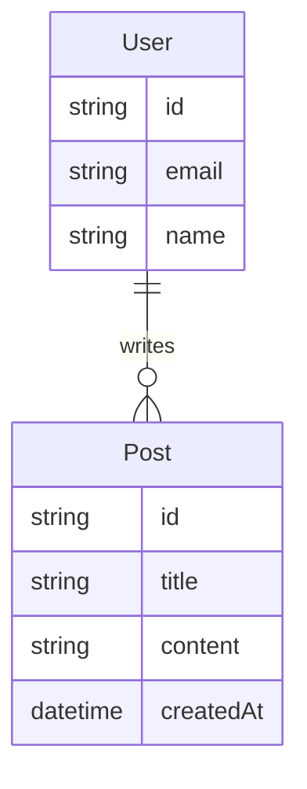

# 架构设计器

## 核心目标
从 PRD 出发，输出简洁、可执行的架构方案到 `docs/02-ARCHITECTURE.md`

## 输入
- `docs/01-PRD.md` — 已完成的 PRD
- 项目边界信息

## 输出
- `docs/02-ARCHITECTURE.md` — 架构文档
- 技术栈锁定声明
- Protected Region 标记

## 工作步骤

### Step 1: 技术栈锁定
- 前端框架 / 后端框架 / 数据库 / 部署方式
- 每个选型写一句话理由
- 越可验证越好（"用 PostgreSQL 因为 PRD 要求用户数据持久化"）

### Step 2: 目录分层
- 按功能模块分层，不是按技术层
- 示例：`src/features/auth/`, `src/features/dashboard/`
- 每个目录写职责说明

### Step 3: 核心数据模型
- 实体关系图（mermaid）
- 关键字段列表
- 不展开全部字段，只列核心

### Step 4: 服务端边界
- 哪些逻辑必须在服务端？（鉴权、支付、数据写操作）
- 哪些逻辑可以在客户端？（UI 状态、缓存、非敏感数据展示）
- 鉴权/授权策略简述

### Step 5: Protected Region
- 标记 AI 不可覆盖的文件和区域
- 示例：`src/features/*/service.ts` 中的业务逻辑
- 示例：`src/middleware/auth.ts` 鉴权逻辑

## 输出模板

```markdown
# 架构方案: [项目名称]

## 1. 技术栈
| 层级 | 选型 | 理由 |
|------|------|------|
| 前端 | ... | ... |
| 后端 | ... | ... |
| 数据库 | ... | ... |
| 部署 | ... | ... |

## 2. 目录分层
```
project/
├── src/
│   ├── features/
│   │   ├── auth/          # 注册、登录、session
│   │   ├── dashboard/     # 主面板
│   │   └── ...
│   ├── shared/            # 共享工具
│   └── ...
├── tests/
└── docs/
```

## 3. 核心数据模型


## 4. 服务端边界
- 必须在服务端：用户注册/登录、数据写入、支付
- 可以在客户端：UI 渲染、表单验证、缓存
- 鉴权策略：JWT + httpOnly Cookie

## 5. Protected Region（AI 不可覆盖）
- `src/features/*/service.ts` — 业务逻辑
- `src/middleware/auth.ts` — 鉴权逻辑

## 6. 变更记录
| 日期 | 变更内容 | 原因 |
|------|----------|------|
```