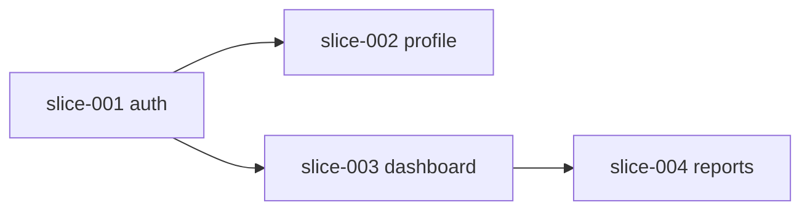

# 切片规格书写器

## 核心目标
将 PRD 中的功能拆分为可独立实现、可并行开发、可验证的垂直切片

## 输入
- `docs/01-PRD.md`
- `docs/02-ARCHITECTURE.md`

## 输出
- `slices/README.md` — 切片总览和依赖图
- `slices/<slice-name>/spec.md` — 每个切片的规格

## 工作步骤

### Step 1: 识别切片边界
- 每个切片是一个垂直端到端功能（DB → API → UI）
- 切片粒度：一个人可在一小时内 review 完
- 切片之间尽量无依赖

### Step 2: 绘制依赖图
用 mermaid 绘制切片依赖关系

### Step 3: 为每个切片写 spec
每个切片包含：
- 切片编号和名称
- 前置依赖（哪些切片必须先完成）
- 涉及的文件清单
- 验收标准
- 测试 anchor
- Protected Region 标记

## 输出模板

### slices/README.md

```markdown
# 切片总览

## 依赖图


## 切片列表
| 编号 | 名称 | 前置依赖 | 状态 | 负责人 |
|------|------|----------|------|--------|
| 001 | auth | 无 | 待开始 | AI-A |
| 002 | profile | 001 | 待开始 | AI-B |
| 003 | dashboard | 001 | 待开始 | AI-C |
| 004 | reports | 003 | 待开始 | AI-D |
```

### slices/<编号>-<名称>/spec.md

```markdown
# 切片: [名称]

## 编号
slice-001

## 前置依赖
- 无 / [slice-xxx]

## 涉及文件
- `src/features/auth/handler.ts`
- `src/features/auth/schemas.ts`
- `src/features/auth/repository.ts`

## 验收标准
- [ ] 用户可以注册新账号
- [ ] 用户可以登录已注册账号
- [ ] 登录失败显示"账号或密码错误"
- [ ] 连续 5 次失败后锁定 15 分钟
- [ ] 登录成功后跳转到 /dashboard

## 测试 anchor
- 单元测试：`tests/unit/auth.test.ts`
- 集成测试：`tests/integration/auth.test.ts`
- E2E 测试：`e2e/auth.spec.ts`

## Protected Region（AI 不可覆盖）
- `src/features/auth/service.ts` — 业务逻辑
```