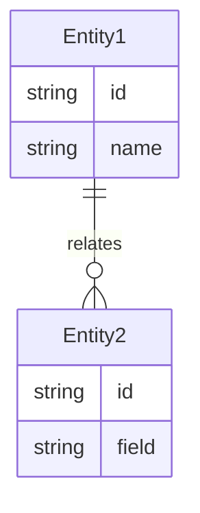

# 架构方案: [项目名称]

## 1. 技术栈
| 层级 | 选型 | 理由 |
|------|------|------|
| 前端 | | |
| 后端 | | |
| 数据库 | | |
| 部署 | | |

## 2. 目录分层
```
project/
├── src/
│   ├── features/
│   │   ├── auth/          # 注册、登录、session
│   │   ├── dashboard/     # 主面板
│   │   └── ...
│   ├── shared/            # 共享工具
│   └── ...
├── tests/
└── docs/
```

## 3. 核心数据模型


## 4. 服务端边界
- 必须在服务端：
- 可以在客户端：
- 鉴权策略：

## 5. Protected Region（AI 不可覆盖）
- `src/features/*/service.ts` — 业务逻辑
- `src/middleware/auth.ts` — 鉴权逻辑

## 6. 变更记录
| 日期 | 变更内容 | 原因 |
|------|----------|------|