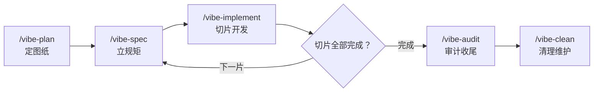

# vibecoding-template

> **Vibe Coding 工作流模板仓库** — 给 AI Agent（opencode 等）配上"图纸、地基、规矩、门禁"：可复制的项目脚手架 + 19 个全局 Skill + 13 条命令 + 提交前机器校验，让"边聊边写"有章法、可验证、不漂移。

[](LICENSE)
[](#skills-一览19-个)
[](#工作流命令)
[](#质量防线)

## 这是什么

一套**让 AI 辅助开发从"凭感觉"变成"有章法"的工作流模板**。普通 vibe coding 的四个坑——聊到哪写到哪、无需求基线、无架构决策、无验收门禁——在这里被一条固化的流水线替代：

**定图纸（`/vibe-plan`）→ 立规矩（`/vibe-spec`）→ 切片开发（`/vibe-implement`）→ 审计收尾（`/vibe-audit`）**

图纸、规矩、门禁全部落成文件（PRD / 架构 / 宪法 / 切片规格 / 门禁脚本）：AI 每次会话读同样的真源，不再靠猜；提交前由机器校验兜底，不再靠 AI 自觉。本仓库自身就按这套工作流运行（[docs/](docs/) 下全套文档齐备，Dogfooding）。

## 特性一览

- ✅ **Spec-driven**：PRD → NFR → 架构 → 契约 → 切片规格，先图纸后编码，每片有验收标准
- ✅ **成熟方案优先**：10 维架构选型目录（架构风格/前端/后端/数据库/缓存/高并发/事务/CI/CD/灾备/部署），每维带推荐与优劣，不现场发明
- ✅ **机器门禁**：commit 前自动跑 quality-gate（密钥扫描/测试强制/结构检查）+ check-sync 漂移检测 S1-S7
- ✅ **防漂移三件套**：单一真源 + 多副本哈希校验 + 误报/漏报矩阵回归——同步不靠自觉
- ✅ **危险命令拦截**：guard 插件拦截 `rm -rf` 全变体、`sudo/doas` 关机、`format` 格式化（16+22 矩阵用例全绿）
- ✅ **技术栈无关**：模板不绑定语言；ts / react / vue / node / python / c / api / html / shell / 小程序 10 个专项规范 skill 按文件类型自动路由
- ✅ **提交历史可读**：CM11 规范——subject 与 Body 都是文件功能描述（Body 列出全部变更文件各自的功能），不读 diff 也能看懂仓库

## 快速开始

**要求**：[Node.js](https://nodejs.org/) ≥ 18（quality-gate / check-sync 为纯 Node 脚本）、[opencode](https://opencode.ai/)（命令与 skill 宿主）；同步脚本为 PowerShell。

```bash
# 1. 克隆并同步全局命令与 skill（opencode 全局可用）
git clone https://github.com/0009-aaf/vibecoding-template.git
cd vibecoding-template
powershell -ExecutionPolicy Bypass -File scripts/sync-global.ps1

# 2. 新建项目：复制脚手架
cp -r starter-template/ /path/to/my-project && cd /path/to/my-project

# 3. 改 AGENTS.md（项目名 + 一段话定位），然后开跑第一个命令
opencode /vibe-plan
```

安装验证（应看到）：

```bash
node scripts/check-sync.mjs
# ✅ 漂移检测通过（阻断 0）
```

已有项目不想复制脚手架？只做第 1 步装全局命令，再把 `starter-template/.opencode/quality-gate.js` 拷入项目的 `.opencode/`，即可获得提交门禁。

## 工作流命令

**vibe 主工作流（7 条）**

| 命令 | 阶段 | 产出 |
|------|------|------|
| `/vibe-plan` | 定图纸 | PRD + NFR + 架构 + 安全基线 + 宪法（01-PRD / 02-ARCH / 07-SECURITY / constitution） |
| `/vibe-spec` | 立规矩 | 切片规格与契约（04-CONTRACTS + slices/<n>/spec.md） |
| `/vibe-implement` | 开发 | 切片实现 + 测试 + e2e 验证 + CHANGELOG / 技术债登记 |
| `/vibe-audit` | 收尾 | 全量审查：质量 / 架构一致性 / 文档同步 / 安全 / 技术债 / 漂移 |
| `/vibe-status` | 查看 | 项目全貌：切片进度 / 活跃项 / 下一步 |
| `/vibe-clean` | 维护 | 清理孤儿 worktree / 分支 / 临时文件 |
| `/vault-sync` | 沉淀 | 决策 / 教训写入 Obsidian Vault |

**Agent Team 辅助（5 条）**：`/execution-plan`（执行计划编排）· `/plan-design`（方案设计编排）· `/focus-start` `/focus-status` `/focus-done`（专注会话三件套）

另有 `vibe-README.md`（命令族导航文档，非执行命令）——共 13 个命令文件。



## Skills 一览（19 个）

**方法 skill（5 个）**

| Skill | 职责 |
|-------|------|
| `prd-generator` | 原始需求 → 结构化 PRD / NFR / 验收标准 |
| `architecture-designer` | PRD → 轻量架构：分层 / 数据模型 / 服务端边界 / ADR |
| `architecture-selection` | 10 维成熟架构选型目录，每维选项 + 推荐 + 优劣 |
| `slice-spec-writer` | 功能 → 垂直切片规格（验收 / 依赖 / 测试 anchor / Protected Region） |
| `e2e-verifier` | 浏览器端到端验证方案 |

**coding-standards 族（11 个）**：总纲 `coding-standards`（81 条编号规则 + 语言路由表 + CM1-CM11 提交规范）按文件类型自动路由到 ts / react / vue / node / python / c / api / html / shell / wx 十个专项 skill。

## 质量防线

| 防线 | 入口 | 拦什么 |
|------|------|--------|
| `quality-gate.js` | commit 前（vibe-gate 插件调起；三副本哈希一致） | 密钥入库（M01）、测试未跑（G 系列）、跨 feature import（M10）、Protected Region 擅改、UI 预览素材违规（G05.7：emoji/位图） |
| `check-sync.mjs` S1-S8 | commit 前（强制） | 多副本漂移、悬空命令 / skill 引用、部署滞后、双源模板失配、文档结构违规、skill 路由断裂、文档声明机制缺失（S8） |
| `guard` 插件 | 工具调用时 | `rm -rf` 全变体、`sudo/doas` 关机、`format` 格式化等危险命令 |
| 矩阵回归 | 手动 / CI | guard 16+22、密钥 10+8、UI 素材红线 10+9 误报 / 漏报用例全绿（防御机制必测） |

逃生阀：`SKIP_CHECK_SYNC=1` / `SKIP_VIBE_GATE=1` 跳过一次，须在 commit message 写明原因留痕（见 [docs/06-RUNBOOK.md](docs/06-RUNBOOK.md)）。

## 仓库结构

```
vibecoding-template/
├── constitution.md       # ★ 项目宪法（13 条不可协商条款，违背即否决）
├── starter-template/     # ★ 项目脚手架（复制到新项目）
│   ├── AGENTS.md         #   AI 行为约束（顶部引用宪法）
│   ├── README.md / .gitignore / docs/ / slices/
│   └── .opencode/quality-gate.js   # 提交门禁（随项目带走）
├── global/               # ★ 全局真源（同步到 ~/.config/opencode）
│   ├── skills/           #   19 个 Skill 真源
│   ├── commands/         #   13 个命令文件（7 vibe 工作流 + 5 Agent Team + 导航）
│   ├── templates/        #   10 个文档 / 脚本模板（ARCH / DoD / SECURITY / CONTRACTS / …）
│   └── plugins/          #   5 个插件（vibe-gate / guard / clawd-bridge / vision-bridge / vault-sync）
├── scripts/
│   ├── sync-global.ps1       # 部署：global/ → ~/.config/opencode（含自检）
│   ├── check-sync.mjs        # 漂移检测器 S1-S8（commit 前强制）
│   └── ui-redline-matrix.mjs # G05.7 UI 素材红线误报/漏报矩阵
└── docs/                 # 本仓库自身全套文档（Dogfooding）
```

## 文档导航

| 文档 | 内容 |
|------|------|
| [docs/00-DOC-STANDARD.md](docs/00-DOC-STANDARD.md) | 文档规范：编号白名单、必备结构、缺席规则 |
| [docs/01-PRD.md](docs/01-PRD.md) · [02-ARCHITECTURE](docs/02-ARCHITECTURE.md) · [03-STATUS](docs/03-STATUS.md) | 本仓库自身的需求 / 架构 / 状态（工作流实例） |
| [docs/05-DECISIONS.md](docs/05-DECISIONS.md) | ADR 决策记录（ADR-001 起） |
| [docs/06-RUNBOOK.md](docs/06-RUNBOOK.md) | 部署、同步约定与对账表 |
| [docs/07-SECURITY.md](docs/07-SECURITY.md) | 安全基线与威胁清单 |
| [docs/09-DESIGN.md](docs/09-DESIGN.md) | 界面设计体系 |
| [docs/TECH-DEBT.md](docs/TECH-DEBT.md) | 技术债登记簿（含销账记录） |

## FAQ

**必须用 opencode 吗？**
命令与 skill 按 opencode 目录约定组织；`quality-gate.js` / `check-sync.mjs` 是纯 Node 脚本，任何环境可用。思路可移植到 Claude Code / Cursor / Cline（把 skill 换成对应 rules / 记忆机制）。

**怎么升级到新版本？**
仓库是唯一真源：`git pull` 后重跑 `scripts/sync-global.ps1`（内置自检会校验镜像与全局部署一致性）。

**门禁误拦了怎么办？**
逃生阀 `SKIP_CHECK_SYNC=1`（漂移检测）/ `SKIP_VIBE_GATE=1`（全部门禁）可跳过一次，但必须在 commit message 写明原因留痕。

**和"直接让 AI 写代码"的区别？**
AI 仍然写代码，但图纸（PRD / 架构 / 宪法）、验收（切片规格 / DoD）、兜底（提交门禁 / 漂移检测 / 危险命令拦截）都是文件和脚本——会话可以中断，规矩不会丢。

## Roadmap

- sync-global 检测"只增不删"（全局目录残留旧文件时告警）
- 三套 M 编号（总纲规则 / 模块边界 / 门禁检查项）统一编号空间
- e2e-verifier 浏览器验证链路现代化
- 根 AGENTS.md 与全局配置的自动化对齐校验

## 兼容性

- 目标宿主：opencode（全局 skill / command 按 opencode 目录约定）
- 思路可移植：Claude Code / Cursor / Cline
- 技术栈无关：模板不绑定具体语言 / 框架

## 贡献

欢迎 issue / PR。提交前请跑 `node scripts/check-sync.mjs` 与 `node .opencode/quality-gate.js`（commit 钩子也会强制执行）；提交消息遵循 CM11——Body 列出全部变更文件的功能描述。

## 项目状态

活跃维护中（进度与全貌见 [docs/03-STATUS.md](docs/03-STATUS.md)）。

## License

MIT
