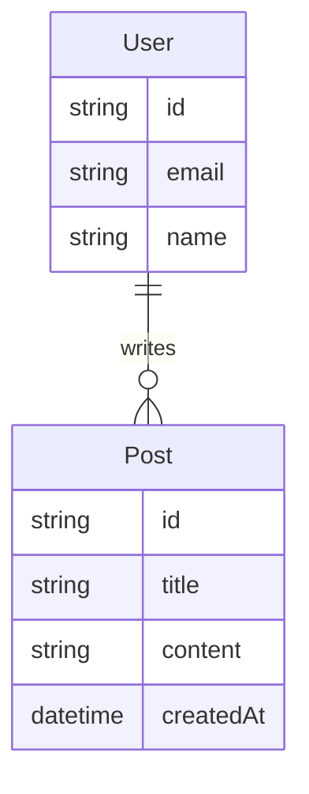

# 架构设计器

## 核心目标
从 PRD 出发，输出简洁、可执行的架构方案到 `docs/02-ARCHITECTURE.md`

## 输入
- `docs/01-PRD.md` — 已完成的 PRD
- 项目边界信息

## 输出
- `docs/02-ARCHITECTURE.md` — 架构文档
- 技术栈锁定声明
- Protected Region 标记

## 工作步骤

### Step 0: NFR 输入（架构选型的依据）
- 读 `docs/01-PRD.md` §3.1 的 NFR（规模/SLO/并发/一致性/合规/RTO·RPO/部署/技能栈）
- NFR 数值直接驱动 Step 1 技术栈和 Step 9 选型，禁止凭空选择
- NFR 缺失 → 回退 prd-generator 补齐，不跳过

### Step 1: 技术栈锁定
- 前端框架 / 后端框架 / 数据库 / 部署方式
- 每个选型写一句话理由
- 越可验证越好（"用 PostgreSQL 因为 PRD 要求用户数据持久化"）
- **选型必须来自 architecture-selection 目录**（先调 `architecture-selection` skill），禁止模型默认值现场发明

### Step 2: 目录分层
- 按功能模块分层，不是按技术层
- 示例：`src/features/auth/`, `src/features/dashboard/`
- 每个目录写职责说明

### Step 3: 核心数据模型
- 实体关系图（mermaid）
- 关键字段列表
- 不展开全部字段，只列核心

### Step 4: 服务端边界
- 哪些逻辑必须在服务端？（鉴权、支付、数据写操作）
- 哪些逻辑可以在客户端？（UI 状态、缓存、非敏感数据展示）
- 鉴权/授权策略简述

### Step 5: Protected Region
- 标记 AI 不可覆盖的文件和区域
- 示例：`src/features/*/service.ts` 中的业务逻辑
- 示例：`src/middleware/auth.ts` 鉴权逻辑

### Step 6: 库清单（强制性）
列出批准使用的第三方库。AI 实现时只能用清单中的库，禁止自造轮子。

| 库 | 版本 | 用途 | 禁止自造 |
|----|------|------|----------|
| zod | ^3.23 | 数据校验 | ✅ 禁止自写 validator |
| drizzle-orm | ^0.30 | ORM | ✅ 禁止自写 SQL builder |
| dayjs | ^1.11 | 日期处理 | ✅ 禁止自写 date utils |

规则：
- 需要引入新库 -> 先更新本清单（变更管理），再实现
- 清单外的库 -> quality-gate 阻断（M16）
- `src/shared/lib/` 只放业务工具，不放库的等价功能

### Step 7: 命名约定
- API 路径：`/api/v1/<资源复数>`
- API 字段：camelCase
- 数据库表：复数 snake_case（users, posts）
- 数据库字段：snake_case（created_at, user_id）
- 文件命名：feature 目录 kebab-case，组件 PascalCase
- 统一术语表（禁止同义词混用）：

| 概念 | 统一命名 | 禁止 |
|------|----------|------|
| 用户ID | userId | uid, user_id, UserID |
| 创建时间 | createdAt | created_at, createTime |
| 是否删除 | isDeleted | deleted, is_deleted |

### Step 8: 测试策略

| 类型 | 框架 | 目录 | 覆盖率目标 |
|------|------|------|-----------|
| 单元测试 | Vitest | `tests/unit/` | 80% |
| 集成测试 | Vitest + supertest | `tests/integration/` | 核心 API 100% |
| E2E 测试 | Playwright | `e2e/` | 验收标准 100% |

测试金字塔：单元 70% / 集成 20% / E2E 10%

TDD 策略（按切片类型）：
- API 端点：**强制先写测试**（测试来自 spec 契约，不是脑补）
- 纯逻辑函数：推荐先写测试
- UI 组件：测试和实现同步写

E2E 要求（按切片类型）：
- 有 UI 交互：**必须 E2E**
- 纯 API：集成测试即可，不要求 E2E
- 基础设施（DB migration/config）：单元测试即可

契约测试：不单独做，用共享 zod schema + 集成测试内嵌验证替代：
- schema 定义在 `src/shared/schemas/*.schema.ts`
- 实现代码 import schema 做请求校验
- 集成测试 import 同一份 schema 验证响应
- 契约变更 = schema 变更 = 集成测试自动失败

CI 要求：
- PR 必须跑 unit + integration
- 合并 main 前必须跑 E2E
- 覆盖率低于目标 -> 阻断

### Step 9: 六主题选型（调用 architecture-selection skill）
- 加载 `architecture-selection` skill，对 NFR 适用的维度用 question 工具弹选项（含 ⭐推荐 + 优劣）
- 十维度：D1 架构风格 / D2 前端客户端 / D3 后端 / D4 数据库 / D5 缓存内存 / D6 高并发 / D7 事务锁 / D8 CICD / D9 灾备 / D10 部署
- 每维输出到 docs/02-ARCHITECTURE.md §9 选型表，一行一维：
  `| 维度 | 选型 | 理由 | ADR# |`
- **不适用必须显式标注**（如 `不适用(本地单机工具,无并发需求)`），禁止静默跳过

### Step 10: ADR 记录（决策留痕）
- 每个非平凡选型写一条 ADR 到 `docs/05-DECISIONS.md`（追加式）：
  ```markdown
  ## ADR-001: 数据库选型 PostgreSQL
  - 日期: YYYY-MM-DD | 状态: Accepted
  - Context: 需要事务+复杂查询，NFR 要求数据持久化
  - Decision: PostgreSQL 16（D4 ⭐）
  - Alternatives: MySQL(锁粒度粗) / MongoDB(无强事务需求)
  - Consequences: + ACID 完整、pgvector 可扩展；- 需 PgBouncer 连接池
  - Verification: 迁移可重复运行 + 恢复演练通过 + 压测满足 QPS
  ```
- ADR 编号递增（ADR-001, ADR-002...）
- 后续变更架构 → 新增 ADR（不修改旧 ADR 的 Decision）

## 输出模板

```markdown
# 架构方案: [项目名称]

## 1. 技术栈
| 层级 | 选型 | 理由 |
|------|------|------|
| 前端 | ... | ... |
| 后端 | ... | ... |
| 数据库 | ... | ... |
| 部署 | ... | ... |

## 2. 目录分层
```
project/
├── src/
│   ├── features/               # 按业务能力分组
│   │   ├── auth/               # 一个 feature = 一个业务能力
│   │   │   ├── domain/         # 领域模型（纯逻辑，无框架依赖）
│   │   │   ├── api/            # API 交互（请求/响应/mapper）
│   │   │   ├── ui/             # UI 展示（组件/样式）
│   │   │   └── index.ts        # Public API（只导出必要的）
│   │   ├── dashboard/
│   │   │   ├── domain/
│   │   │   ├── api/
│   │   │   ├── ui/
│   │   │   └── index.ts
│   │   └── ...
│   ├── shared/                 # 第二个 feature 需要时才提升
│   │   ├── ui/                 # 设计系统组件
│   │   ├── lib/                # 纯工具函数
│   │   └── config/             # 配置
│   └── app/                    # 只做 wiring，不写业务逻辑
├── tests/
└── docs/
```

### 依赖方向规则
```
app -> features -> shared
features 之间 ❌ 不直接 import（走 shared 或事件）
shared -> feature ❌ 禁止
```
- Feature 间不直接 import（M10）
- 只通过 feature 的 index.ts 访问（M14）
- shared 第二个 feature 需要时才提升（M15）

## 3. 核心数据模型


## 4. 服务端边界
- 必须在服务端：用户注册/登录、数据写入、支付
- 可以在客户端：UI 渲染、表单验证、缓存
- 鉴权策略：JWT + httpOnly Cookie

## 5. Protected Region（AI 不可覆盖）
- `src/features/*/service.ts` - 业务逻辑
- `src/middleware/auth.ts` - 鉴权逻辑

## 6. 库清单（强制性）
| 库 | 版本 | 用途 | 禁止自造 |
|----|------|------|----------|
| zod | ^3.23 | 数据校验 | ✅ |
| drizzle-orm | ^0.30 | ORM | ✅ |
| ... | ... | ... | ... |

> 引入新库必须先更新本清单。`src/shared/lib/` 禁止放库的等价功能。

## 7. 命名约定
- API 路径：`/api/v1/<资源复数>`
- API 字段：camelCase
- 数据库表：复数 snake_case
- 统一术语表：userId / createdAt / isDeleted

## 8. 测试策略
| 类型 | 框架 | 目录 | 覆盖率 |
|------|------|------|--------|
| 单元 | Vitest | tests/unit/ | 80% |
| 集成 | Vitest+supertest | tests/integration/ | 核心API 100% |
| E2E | Playwright | e2e/ | 验收标准 100% |

TDD：API 强制先写测试 / UI 同步写
E2E：有 UI 必须 / 纯 API 不要求
契约测试：共享 zod schema 内嵌集成测试

## 9. 六主题选型（来自 architecture-selection 目录）
| 维度 | 选型 | 理由 | ADR# |
|------|------|------|------|
| 架构风格 | Modular Monolith | 小型应用,单体足够 | ADR-001 |
| 数据库 | PostgreSQL | 需事务+持久化 | ADR-001 |
| 缓存/内存 | Redis cache-aside | 读多写少 | ADR-002 |
| 高并发 | 不适用(本地工具,无并发) | - | - |
| 事务和锁 | READ COMMITTED+乐观锁 | 默认隔离够用 | ADR-003 |
| CICD | GitHub Actions | 托管零运维 | ADR-004 |
| 灾备 | 3-2-1备份+恢复演练 | 有数据必备份 | ADR-005 |
| 部署 | Docker Compose | 单机多服务 | ADR-006 |

> 每维必须"有决策 或 显式不适用"。详见 docs/05-DECISIONS.md。

## 10. 变更记录
| 日期 | 变更内容 | 原因 |
|------|----------|------|
```