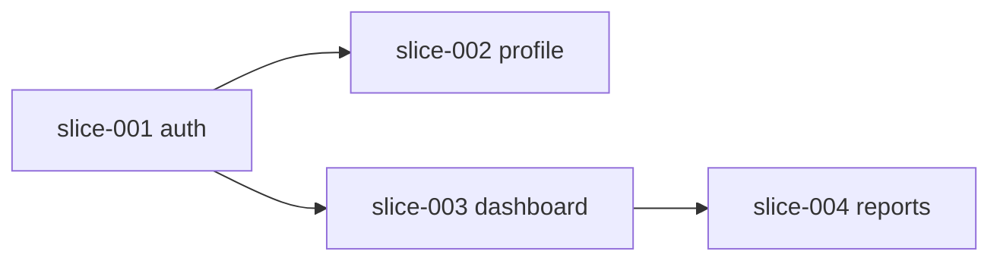

# 切片规格书写器

## 核心目标
将 PRD 中的功能拆分为可独立实现、可并行开发、可验证的垂直切片

## 输入
- `docs/01-PRD.md`
- `docs/02-ARCHITECTURE.md`

## 输出
- `slices/README.md` — 切片总览和依赖图
- `slices/<slice-name>/spec.md` — 每个切片的规格

## 工作步骤

### Step 1: 识别切片边界
- 每个切片是一个垂直端到端功能（DB -> API -> UI）
- 切片粒度：一个用户故事，端到端可独立交付和验证
- 切片之间尽量无依赖

**切片类型判断标准**（决定测试要求等级）：
| 类型 | 判断条件 | 测试要求 |
|------|----------|----------|
| UI | 涉及用户交互（页面、组件、表单、路由跳转） | 单元 + 集成 + E2E |
| API | 涉及 HTTP 端点但无 UI 交互 | 单元 + 集成 |
| 基础设施 | DB migration、config、CI 脚本、无 HTTP 端点 | 单元 |
| 全栈 | 同时涉及 UI + API + DB | 按最高要求：单元 + 集成 + E2E |

> 如果切片同时有 UI 和 API，标注为"全栈"，按 UI 标准要求 E2E。

### Step 2: 绘制依赖图
用 mermaid 绘制切片依赖关系

### Step 3: 为每个切片写 spec
每个切片包含：
- 切片编号和名称
- 切片类型（API / UI / 基础设施）-> 决定测试要求等级
- 前置依赖（哪些切片必须先完成）
- 涉及的文件清单（该切片独占）
- 共享文件（多个切片共同修改的文件，如 router/config/registry）
- 验收标准
- **UI 依据**（仅 UI/全栈切片）：引用 `docs/09-DESIGN.md` 条目编号（§2 页面行、§3 组件行、§4 五态），实现不得偏离
- 测试 anchor
- Protected Region 标记
- session-id（初始为空，锁定时填入）
- 分支名（`slice/<编号>-<名称>`）

### Step 4: 接口契约 + 测试定义
为每个切片定义对外接口和测试要求，写入 `docs/04-CONTRACTS.md` 和 `spec.md`。

#### 4.1 API 端点契约（写入 docs/04-CONTRACTS.md）
```
POST /api/v1/auth/register
  Request: { email: string, password: string }
  Response 200: { user: User, token: string }
  Response 422: { errors: Array<{ field: string, message: string }> }
  错误码: AUTH-001 邮箱重复(409) / AUTH-002 密码强度不足(422)
  性能预算: P95 < 300ms
```

**错误码规则**：每个非 2xx 响应必须有注册错误码——格式 `<域>-<三位数>`（域 = feature 名大写），
同步登记到 `docs/04-CONTRACTS.md` 全局错误码注册表；禁止切片私造未登记错误码、
禁止复用其他切片的错误码语义。UI 端错误文案按码映射，展示走 `docs/09-DESIGN.md` §4 error 态。

#### 4.2 导出类型（写入 docs/04-CONTRACTS.md）
```
export interface User { id: string; email: string; name: string }
export type AuthResult = { user: User; token: string }
```

#### 4.3 共享 schema 定义（只定义结构，不写代码）
- 在 `spec.md` 和 `docs/04-CONTRACTS.md` 中定义 schema 结构（字段名 + 类型 + 校验规则）
- 实际 zod 代码在 `/vibe-implement` 阶段2a 编写
- 示例（写在 spec.md 中，不是代码文件）：
  ```
  registerRequestSchema: { email: string(email), password: string(min=8) }
  authResultSchema: { user: User, token: string }
  ```

#### 4.4 测试定义（写入 spec.md）
按切片类型决定测试等级：
- **API 切片**：单元 + 集成（必须），E2E 不要求
- **UI 切片**：单元 + 集成 + E2E（必须）
- **基础设施切片**：单元（必须）

```
单元测试：
- tests/unit/<feature>.test.ts
- 用例：成功路径 / 失败路径 / 边界条件

集成测试：
- tests/integration/<feature>-api.test.ts
- 用例：每个 API 端点的成功/失败/边界
- 验证：HTTP 状态码 + 响应匹配 zod schema

E2E 测试（有 UI 的切片）：
- e2e/<feature>.spec.ts
- 场景：用户完整操作流程（来自验收标准）

测试数据：
- tests/fixtures/<feature>.json
- 正常数据 / 边界数据 / 恶意数据
```

#### 4.5 切片类型标注
在 spec.md 头部标注切片类型，quality-gate 按类型检查测试要求。

## 输出模板

### slices/README.md

```markdown
# 切片总览

## 依赖图


## 切片列表
| 编号 | 名称 | 前置依赖 | 状态 | session-id | 分支 |
|------|------|----------|------|------------|------|
| 001 | auth | 无 | 待开始 | | slice/001-auth |
| 002 | profile | 001 | 待开始 | | slice/002-profile |
| 003 | dashboard | 001 | 待开始 | | slice/003-dashboard |
| 004 | reports | 003 | 待开始 | | slice/004-reports |
```

### slices/<编号>-<名称>/spec.md

```markdown
# 切片: [名称]

## 切片类型
API / UI / 基础设施

## 编号
slice-001

## 前置依赖
- 无 / [slice-xxx]

## 涉及文件（按 feature 分组）
### feature: auth（本切片独占）
- `src/features/auth/api/handler.ts`
- `src/features/auth/api/schemas.ts`
- `src/features/auth/domain/repository.ts`
### feature: auth Public API
- `src/features/auth/index.ts`（新增导出）

## 共享文件（追加式修改，用标记包裹）
- `src/shared/config/routes.ts` - 追加路由
- `src/shared/config/index.ts` - 导出新路由
- `src/shared/schemas/auth.schema.ts` - 新增 schema

> 共享文件修改必须用标记包裹：
> `// @slice:001-auth` ... `// @end-slice:001-auth`
> 不同切片的标记区域在 rebase 时自动合并，不冲突。

## 接口契约（同步写入 docs/04-CONTRACTS.md）
### API 端点
POST /api/v1/auth/register
  Request: { email: string, password: string }
  Response 200: { user: User, token: string }
  Response 422: { errors: Array<{ field: string, message: string }> }
  错误码: AUTH-001 邮箱重复(409) / AUTH-002 密码强度不足(422)
  性能预算: P95 < 300ms

### UI 依据（UI/全栈切片）
- `docs/09-DESIGN.md` §2 页面：登录页（/login）
- `docs/09-DESIGN.md` §4 五态：error 态（错误码→文案映射展示）

### 导出类型
export interface User { id: string; email: string; name: string }
export type AuthResult = { user: User; token: string }

### 共享 schema
- `src/shared/schemas/auth.schema.ts`
- registerRequestSchema, loginRequestSchema, authResultSchema

## 验收标准
- [ ] 用户可以注册新账号
- [ ] 用户可以登录已注册账号
- [ ] 登录失败显示"账号或密码错误"
- [ ] 连续 5 次失败后锁定 15 分钟
- [ ] 登录成功后跳转到 /dashboard

## 测试定义
### 单元测试（必须）
- `tests/unit/auth.test.ts`
- 用例：register 成功 / register 邮箱重复 409 / register 密码弱 422 / login 成功 / login 密码错 422

### 集成测试（必须）
- `tests/integration/auth-api.test.ts`
- 用例：POST /register -> 200+DB有记录 / POST /register 重复 -> 409 / POST /login -> 200+token有效
- 验证：响应匹配 zod schema

### E2E 测试（UI 切片必须，API 切片不要求）
- `e2e/auth.spec.ts`
- 场景：注册->跳转首页 / 已存在邮箱->提示 / 登录失败5次->锁定

### 测试数据
- `tests/fixtures/users.json`
- 正常用户 / 边界用户（空密码、超长邮箱）/ 恶意用户

## 测试 anchor
- 单元测试：`tests/unit/auth.test.ts`
- 集成测试：`tests/integration/auth-api.test.ts`
- E2E 测试：`e2e/auth.spec.ts`

## Protected Region（AI 不可覆盖）
- `src/features/auth/service.ts` - 业务逻辑
```