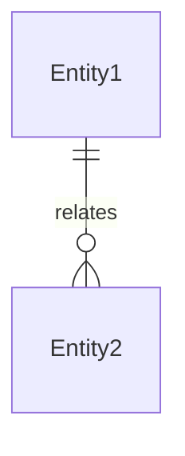

# 架构方案: [项目名称]

<!-- sync-hash: 4 -->
> 快速参考模板。**真源在 `architecture-designer` skill 的输出模板**——两处不一致时以 skill 为准，改动须双向同步（并同步 bump 两侧 sync-hash，scripts/check-sync.mjs 检查 5 校验相等）。

## 1. 技术栈
| 层级 | 选型 | 理由 |
|------|------|------|
| 前端 | | |
| 后端 | | |
| 数据库 | | |
| 部署 | | |

## 2. 目录分层
```
project/
├── src/
│   ├── features/               # 按业务能力分组，一个 feature = 一个业务能力
│   │   ├── auth/
│   │   │   ├── domain/         # 领域模型（纯逻辑，无框架依赖）
│   │   │   ├── api/            # API 交互
│   │   │   ├── ui/             # UI 展示
│   │   │   └── index.ts        # Public API（只导出必要的）
│   │   └── ...
│   ├── shared/                 # 第二个 feature 需要时才提升
│   └── app/                    # 只做 wiring，不写业务逻辑
├── tests/
└── docs/
```

依赖方向：`app -> features -> shared`；features 之间不直接 import（M10）；shared 不反向依赖 feature。

## 3. 核心数据模型


**迁移规范**（涉及数据库时必答）：
- 命名 `<时间戳>_<动作>_<对象>`；每个迁移必须可回滚
- destructive 迁移（删列/删表/改类型丢数据）：先记 ADR + 备份先行

## 4. 服务端边界
- 必须在服务端：
- 可以在客户端：
- 鉴权策略：

## 5. Protected Region（AI 不可覆盖）
- `src/features/*/service.ts` — 业务逻辑
- `src/middleware/auth.ts` — 鉴权逻辑

## 6. 库清单（强制性）
| 库 | 版本 | 用途 | 禁止自造 |
|----|------|------|----------|
| | | | |

> 引入新库必须先更新本清单。`src/shared/lib/` 禁止放库的等价功能。

## 7. 命名约定
- API 路径：`/api/v1/<资源复数>`
- API 字段：camelCase
- 数据库表：复数 snake_case
- 统一术语表：userId / createdAt / isDeleted

## 8. 测试策略
| 类型 | 框架 | 目录 | 覆盖率 |
|------|------|------|--------|
| 单元 | | tests/unit/ | 80% |
| 集成 | | tests/integration/ | 核心 API 100% |
| E2E | | e2e/ | 验收标准 100% |

## 9. 十维度选型（D1–D10，来自 architecture-selection 目录）
| 维度 | 选型 | 理由 | ADR# |
|------|------|------|------|
| D1 架构风格 | | | |
| D2 前端客户端 | | | |
| D3 后端 | | | |
| D4 数据库 | | | |
| D5 缓存/内存 | | | |
| D6 高并发 | | | |
| D7 事务和锁 | | | |
| D8 CICD | | | |
| D9 灾备 | | | |
| D10 部署 | | | |

> 每维必须"有决策 或 显式不适用(理由)"。详见 docs/05-DECISIONS.md。
> D5 选中缓存时：失效策略必答（cache-aside / write-through / TTL + 主动失效），写入"理由"列。

## 10. 变更记录
| 日期 | 变更内容 | 原因 |
|------|----------|------|
